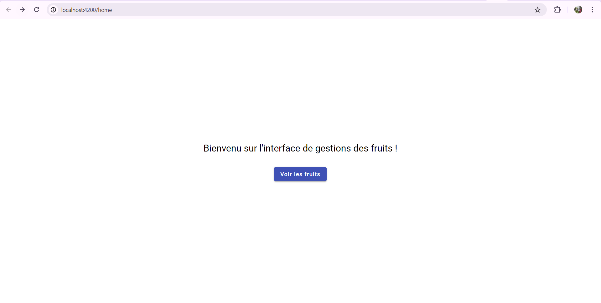
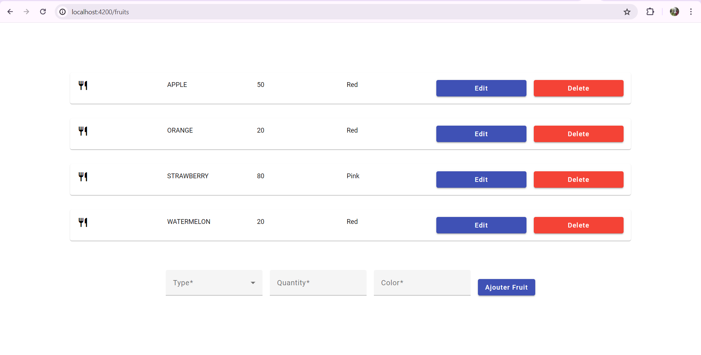

# Fruit Market

## Description
This is a simple application that allows users to add fruits to a list and then calculate the total number of the fruits in the list. The user can also remove fruits from the list.

## Installation
1. Clone the repository
2. Run `npm install` to install the dependencies
3. Run `ng serve` to start the application

## Usage
1. Enter the name of the fruit in the input field
2. Click the "Add Fruit" button to add the fruit to the list
3. Click the "Delete" button to remove the fruit from the list
4. Click the "Edit" button to edit the fruit in the list

## Screenshots

## License
This project is licensed under the MIT license.

